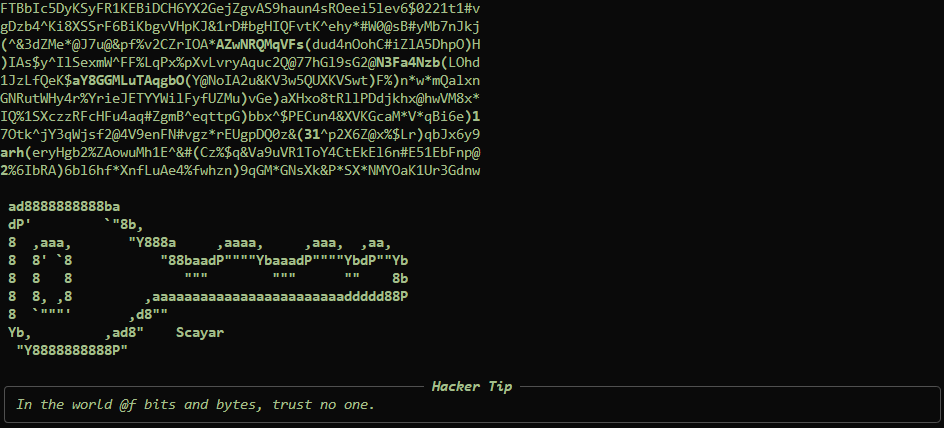
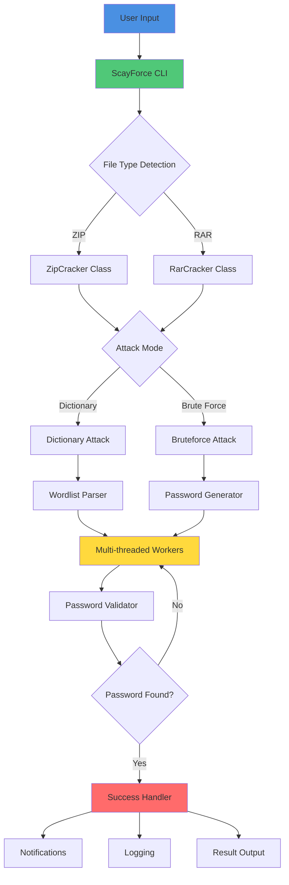
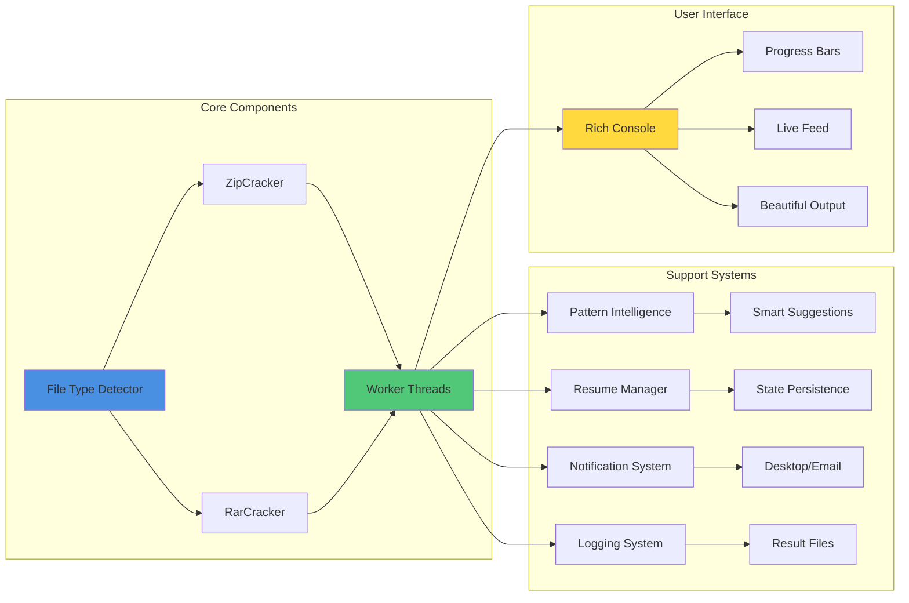
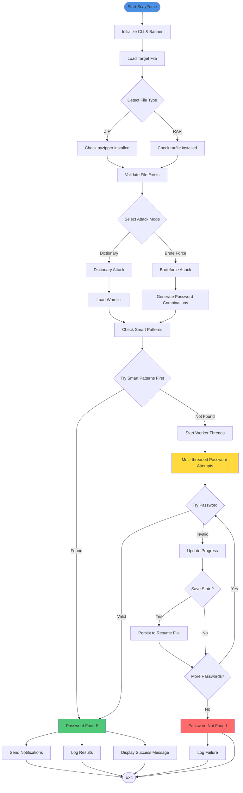
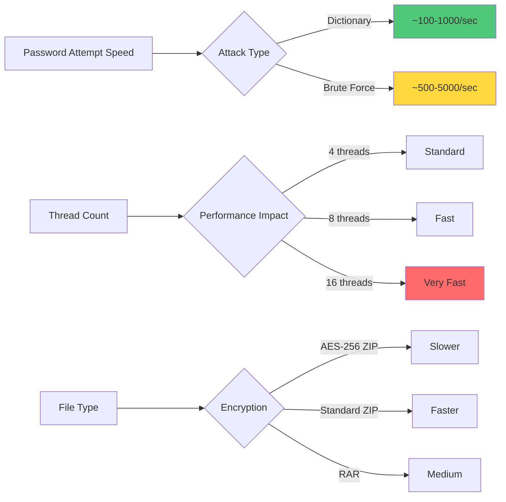

<!-- Banner -->
<p align="center">
  
</p>

<h1 align="center">🚀 ScayForce</h1>
<p align="center">
  <b>The Ultimate Modern Password Cracker for ZIP/RAR Archives</b><br>
  <i>A powerful, feature-rich password recovery tool with beautiful CLI and advanced cracking capabilities</i>
</p>

<p align="center">
  <a href="https://scayar.com"></a>
  <a href="https://t.me/im_scayar"></a>
  <a href="mailto:Scayar.exe@gmail.com"></a>
  <a href="https://buymeacoffee.com/scayar"></a>
</p>

<p align="center">
  
  
  
</p>

---

## 📋 Table of Contents

- [✨ Features](#-features)
- [🏗️ Architecture](#️-architecture)
- [🔄 Workflow](#-workflow)
- [🚀 Quick Start](#-quick-start)
- [🧑‍💻 Usage Guide](#-usage-guide)
- [🛠️ Advanced Options](#️-advanced-options)
- [📊 Performance](#-performance)
- [🧪 Testing](#-testing)
- [🛡️ Security & Disclaimer](#️-security--disclaimer)
- [📞 Credits](#-credits)

---

## ✨ Features

### Core Capabilities
- 🎯 **Multi-format Support**: Crack both ZIP and RAR archives (AES encryption support)
- 🔀 **Dual Attack Modes**: Dictionary attacks and brute-force attacks
- ⚡ **Multi-threading**: Parallel password attempts for maximum speed
- 🧠 **Smart Pattern Intelligence**: Automatically tries common password patterns based on filename
- 🔄 **Auto-resume**: Resume interrupted sessions without losing progress
- ☁️ **Wordlist Downloader**: Automatically fetch popular wordlists (rockyou.txt)

### User Experience
- 🎨 **Beautiful CLI**: Rich terminal UI with hacker vibes, progress bars, and live updates
- 📊 **Real-time Feed**: See password attempts in real-time with verbose mode
- 📝 **Detailed Logging**: Comprehensive log files for all attempts and results
- 🔔 **Notifications**: Desktop and email notifications when password is found
- 🎬 **Animated Intro**: Matrix-style intro and typewriter banner effects

### Technical Excellence
- ✅ **Error Handling**: Robust error handling and graceful failures
- 📈 **Progress Tracking**: Real-time progress bars with time elapsed
- 💾 **State Persistence**: Save and restore cracking session state
- 🎯 **Smart Suggestions**: Pattern-based password suggestions before main attack

---

## 🏗️ Architecture

### System Architecture Diagram



### Component Overview



---

## 🔄 Workflow

### Cracking Process Flow



---

## 🚀 Quick Start

### Prerequisites

- Python 3.7 or higher
- pip (Python package manager)

### Installation

```bash
# 1. Clone the repository
git clone https://github.com/scayar/ScayForce.git
cd ScayForce

# 2. Install dependencies
pip install -r requirements.txt

# 3. (Optional) Download a wordlist
python ScayForce.py --fetch-wordlist rockyou.txt
```

### Basic Usage

```bash
# Dictionary attack on a ZIP file
python ScayForce.py --file archive.zip --dictionary --wordlist rockyou.txt

# Brute-force attack (numbers only, max length 4)
python ScayForce.py --file archive.zip --bruteforce --charset 0123456789 --max-length 4
```

---

## 🧑‍💻 Usage Guide

### 1️⃣ Dictionary Attack (Recommended)

Use a wordlist file to try common passwords:

```bash
python ScayForce.py --file encrypted.zip --dictionary --wordlist rockyou.txt
```

**Options:**
- `--file`: Path to your ZIP or RAR file
- `--dictionary`: Enable dictionary attack mode
- `--wordlist`: Path to your wordlist file

### 2️⃣ Brute-Force Attack

Try all possible combinations:

```bash
python ScayForce.py --file encrypted.zip --bruteforce --charset 0123456789abcdef --max-length 6
```

**Options:**
- `--bruteforce`: Enable brute-force attack mode
- `--charset`: Characters to use (default: alphanumeric)
- `--max-length`: Maximum password length to try

### 3️⃣ With Auto-Resume

Resume interrupted sessions:

```bash
python ScayForce.py --file encrypted.zip --dictionary --wordlist rockyou.txt --resume
```

### 4️⃣ Verbose Mode

See every password attempt in real-time:

```bash
python ScayForce.py --file encrypted.zip --dictionary --wordlist rockyou.txt --verbose
```

### 5️⃣ Multi-threading

Increase threads for faster cracking:

```bash
python ScayForce.py --file encrypted.zip --dictionary --wordlist rockyou.txt --threads 8
```

### 6️⃣ With Notifications

Get notified when password is found:

```bash
# Desktop notification (automatic)
python ScayForce.py --file encrypted.zip --dictionary --wordlist rockyou.txt --notify

# Email notification
python ScayForce.py --file encrypted.zip --dictionary --wordlist rockyou.txt --notify-email your@email.com
```

---

## 🛠️ Advanced Options

### Complete Option Reference

| Option | Description | Default | Example |
|--------|-------------|---------|---------|
| `--file` | Path to ZIP/RAR file | Required | `--file archive.zip` |
| `--dictionary` | Use dictionary attack | - | `--dictionary` |
| `--wordlist` | Path to wordlist file | Required with `--dictionary` | `--wordlist rockyou.txt` |
| `--bruteforce` | Use brute-force attack | - | `--bruteforce` |
| `--charset` | Characters for brute-force | alphanumeric | `--charset 0123456789` |
| `--max-length` | Max password length | 4 | `--max-length 6` |
| `--threads` | Number of threads | 4 | `--threads 8` |
| `--resume` | Resume from last session | Disabled | `--resume` |
| `--verbose` | Show all attempts | Disabled | `--verbose` |
| `--notify` | Desktop notification | Disabled | `--notify` |
| `--notify-email` | Email notification | - | `--notify-email user@mail.com` |
| `--fetch-wordlist` | Download wordlist | - | `--fetch-wordlist rockyou.txt` |
| `--log` | Log file path | `crack_results.log` | `--log mylog.log` |

### Performance Optimization Tips

```bash
# Use all CPU cores
python ScayForce.py --file archive.zip --dictionary --wordlist rockyou.txt --threads $(nproc)

# Optimize for specific charset
python ScayForce.py --file archive.zip --bruteforce --charset "0123456789" --max-length 4

# Combine resume with verbose for long sessions
python ScayForce.py --file archive.zip --dictionary --wordlist rockyou.txt --resume --verbose
```

---

## 📊 Performance

### Performance Characteristics



### Expected Performance

- **Dictionary Attack**: 100-1,000 passwords/second (depends on file size and encryption)
- **Brute-Force Attack**: 500-5,000 passwords/second
- **Multi-threading**: Linear scaling with thread count (up to CPU cores)
- **Memory Usage**: Low (<100MB for typical wordlists)

---

## 🧪 Testing

### Quick Test with Included Sample

A sample ZIP file (`test.zip`) is included for testing. The password is `123321`.

```bash
# 1. Download wordlist (if not already downloaded)
python ScayForce.py --fetch-wordlist rockyou.txt

# 2. Run dictionary attack
python ScayForce.py --file test.zip --dictionary --wordlist rockyou.txt

# 3. Or try brute-force (faster for this simple password)
python ScayForce.py --file test.zip --bruteforce --charset 0123456789 --max-length 6
```

### Creating Test Archives

```bash
# Create a test ZIP with password
zip -P password123 test.zip file1.txt file2.txt

# Create a test RAR with password
rar a -psecret456 test.rar file1.txt file2.txt
```

---

## 🛡️ Security & Disclaimer

### ⚠️ Legal Notice

**This tool is for educational and authorized security testing purposes only.**

- ✅ Use only on files you own or have explicit permission to test
- ✅ Use for legitimate password recovery (forgotten passwords)
- ✅ Use in authorized penetration testing environments
- ❌ Do NOT use on systems or archives without permission
- ❌ Do NOT use for illegal activities
- ❌ Do NOT violate any laws or regulations

### Security Best Practices

- Always keep wordlists and logs secure
- Use strong passwords for your archives
- Regularly update dependencies
- Review code before using in production environments

---

## 📞 Credits

### Author

**Scayar**

- 🌐 **Website**: [Scayar.com](https://scayar.com)
- 📧 **Email**: [Scayar.exe@gmail.com](mailto:Scayar.exe@gmail.com)
- 💬 **Telegram**: [@im_scayar](https://t.me/im_scayar)
- ☕ **Buy Me a Coffee**: [buymeacoffee.com/scayar](https://buymeacoffee.com/scayar)

### Acknowledgments

- Built with ❤️ by Scayar
- Uses [Rich](https://github.com/Textualize/rich) for beautiful terminal output
- Supports [pyzipper](https://github.com/danifus/pyzipper) for ZIP handling
- Uses [rarfile](https://github.com/markokr/rarfile) for RAR support

### License

All rights reserved © Scayar

---

## ⭐️ Support the Project

If you find ScayForce useful, please:

- ⭐ Star this repository
- 🐛 Report bugs and issues
- 💡 Suggest new features
- 📣 Share with your friends
- ☕ [Buy me a coffee](https://buymeacoffee.com/scayar)

---

<p align="center">
  <b>Made with ❤️ by Scayar</b><br>
  <i>Happy Cracking! 🔓</i>
</p>
